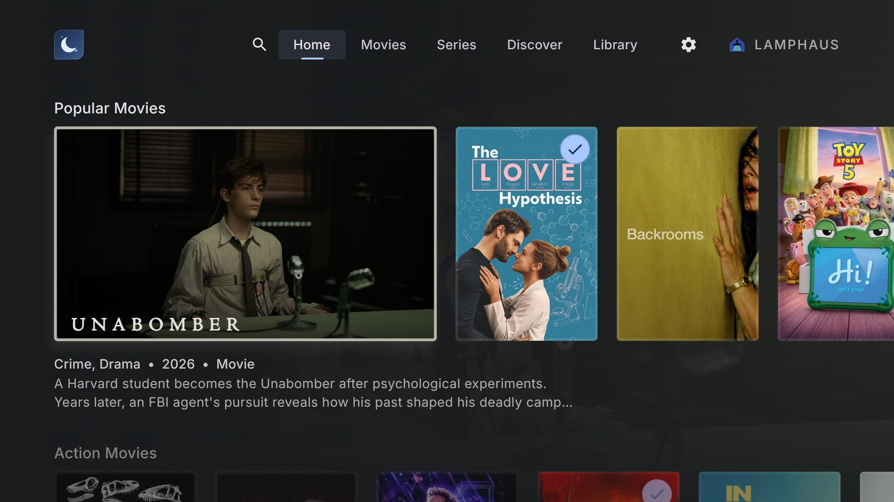
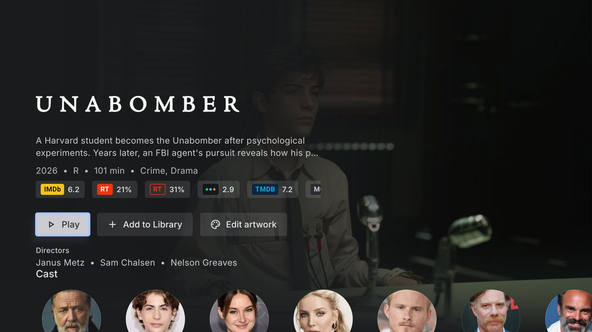
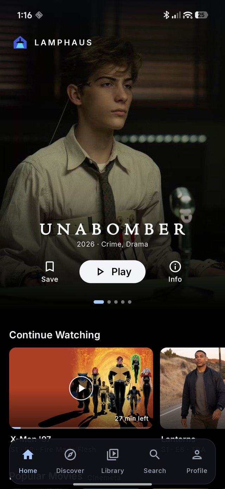

<p align="center">
  
</p>

<h1 align="center">Lamphaus</h1>

<p align="center">
  A calm media home for Android TV, Google TV, and your phone.<br />
  Add the sources you trust; Lamphaus takes care of the picture, the sound, and exactly where you left off.
</p>

<p align="center">
  <a href="https://furkancodes.github.io/lamphaus/download/">Download the beta</a> ·
  <a href="https://furkancodes.github.io/lamphaus/">Website</a> ·
  <a href="https://github.com/FurkanCodes/lamphaus/releases">Releases</a>
</p>

<p align="center">
  
</p>

Lamphaus is one native Android app with purpose-built phone/tablet and television interfaces that share one account, library, and playback progress. It is a player and a library, not a service: you add compatible HTTPS add-ons you trust, and **Lamphaus supplies no content source**.

## Screenshots

<table>
  <tr>
    <td width="72%" valign="top">
      
      <p align="center"><sub>TV details: title, metadata, primary action, then cast and episodes</sub></p>
    </td>
    <td width="28%" valign="top">
      
      <p align="center"><sub>Phone Home with Continue Watching</sub></p>
    </td>
  </tr>
</table>

<sub>Captured on an Android TV box (SEI Box R 4K Plus) and a Xiaomi 15T Pro. Titles and artwork come from the capturing account's own add-ons.</sub>

## Highlights

**Built for the sofa**

- Ten-foot TV interface driven entirely by the remote: a slim side rail (or top bar), Spotlight or Classic Home, and focus you can see from across the room.
- Artwork leads and the interface stays out of the way. Nothing moves while you read; trailer previews play only if you turn them on.
- An optional ambient screensaver drifts through your own library's backdrops.

**Picture and sound**

- Matches the TV's frame rate and resolution, keeps HDR10, HLG, and Dolby Vision where the screen supports them, and passes Dolby and DTS through to your receiver.
- Every source says up front whether it plays natively on this device, or what will change.
- Night listening evens out loud and quiet moments and lifts dialogue.
- Styled subtitles keep their fonts and positions; right-to-left languages read correctly.

**Evenings, planned around you**

- Continue Watching with "Up next" episodes and release countdowns, also on the Google TV home screen and a phone widget.
- An "Ends before …" row of movies you can still finish tonight.
- "Previously" recaps the last episode you finished when you return to a series after a few weeks.
- Auto-play next episode with a "Still watching?" check, or "Up next" prompts if you prefer to choose.

**Phone and TV, one library**

- Pause on the TV and your phone picks up at the same second. Library, progress, and profiles follow you.
- Pair a TV with one scan: the TV shows a code, your phone signs in, no passwords typed with a remote.

**Honest by design**

- Provider-neutral: no bundled content and no affiliation with any media service.
- Add-on addresses are hidden once added and never appear in diagnostics. No ads, no tracking scripts; crash reports only if you turn them on.

## Install

Lamphaus runs on Android 8.0 (API 26) and later, as one APK for phones, tablets, Android TV, and Google TV.

1. Download the latest signed APK from the [download page](https://furkancodes.github.io/lamphaus/download/) or [GitHub Releases](https://github.com/FurkanCodes/lamphaus/releases).
2. Install it on your device (sideload on TV). After that, updates arrive inside the app, signed and verified against the release feed.

## Build from source

1. Install Android SDK platform 36 and Build Tools 36.0.0 or newer.
2. Use JDK 17 or newer and run `./gradlew assembleDebug`.
3. Install the debug APK on a phone or television emulator. Each launcher opens its form-factor activity.

The debug build works without cloud credentials and exposes local account/provider state. To enable production authentication and synchronization, add the Supabase credentials described in [`docs/PRODUCTION_SETUP.md`](docs/PRODUCTION_SETUP.md).

The FFmpeg audio decoders behind `:core:ffmpeg` are committed as prebuilts. The libmpv fallback player engine is not: build it with `scripts/build-mpv-libs.sh` to enable it; without it, playback uses Media3 only.

Before opening a pull request, run the standard local checks:

```bash
./gradlew :app:testDebugUnitTest :app:lintDebug --max-workers=2
./scripts/check-neutrality.sh
```

## Project map

| Path | Contents |
| --- | --- |
| `app` | Mobile and TV Compose roots, navigation, account/provider setup, and system integration |
| `core:model` | Stable product, account, provider, and playback types |
| `core:provider` | HTTPS provider client, protocol parsing, and aggregation |
| `core:data` | Room, preferences, synchronization boundaries, and repositories |
| `core:player` | Media3 playback service and controller, with the optional libmpv engine |
| `core:ffmpeg` | Media3 FFmpeg audio extension for AC-3, E-AC-3, TrueHD, and DTS |
| `benchmark` | Startup benchmarks and baseline profile generation |
| `supabase` | Backend schema and Edge Functions for accounts, sync, and TV pairing |
| `web` | Marketing site and TV pairing page, statically exported to GitHub Pages ([README](web/README.md)) |

## Contributing

- [`RULES.md`](RULES.md) is the source of truth for interface, architecture, release, and quality rules. Read it before any Android UI work and cite the rule IDs that apply.
- [`docs/DEVELOPMENT_AND_RELEASE.md`](docs/DEVELOPMENT_AND_RELEASE.md) describes the branch, version, and release workflow. Production APKs are built and signed locally; GitHub Actions only verifies code and deploys the website.
- [`PRODUCT.md`](PRODUCT.md) and [`DESIGN.md`](DESIGN.md) explain the product intent and design system.
